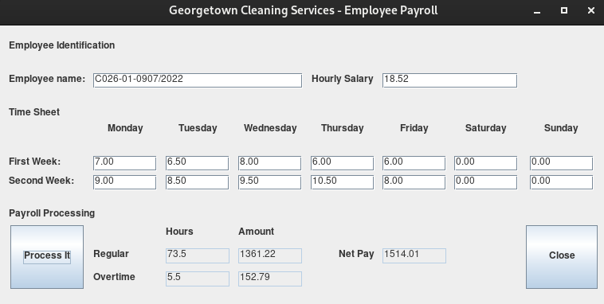

# overtime-calc
A simple overtime calculator that calculates overtime pay based on hours worked

 

 

# How to use
<ul>
  <li>Clone the repo to your computer</li>
  <li>Open a terminal in the cloned directory</li>
  <li>Run the following commands</li>
  
* `$ javac mainForm.java`
* `$ java mainForm`

<li>Type your inputs and calculate away</li>
</ul>

